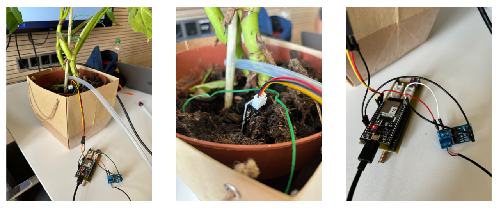

# Automatic Plant Watering Device



## About
The Device uses the Arduino Framework and was developed using PlatformIO. <br>
Code was written for an ESP32 connected with the following sensors:
- BMP280 Pressure sensor

## Deploying
Open this folder ```Device/``` in PlatformIO to deploy onto a Device.