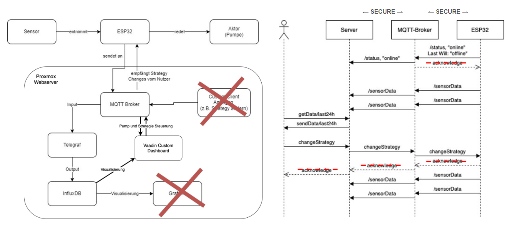

# Automatic Plant Watering Webserver


## About

### Part of a university project

This repository is part of a larger university project. <br>
This is the webserver and the repository for the ESP32 Device can be found [here](https://github.com/greiner-petter/Automatic-Plant-Watering-Device)

### Solution and Strategy
- The Device supports a simple threshold-based strategy to supply the plant with water
- The threshold can be changed from the dashboard
- Optionally, the pump can be activated manually

### Diagrams


## Prerequisites on Ubuntu
```
sudo apt install openjdk-17-jdk
sudo apt-get install nodejs npm
https://raw.githubusercontent.com/nvm-sh/nvm/master/install.sh
nvm install 18
nvm use 18
```

## Running the application (Vaadin only)

The project is a standard Maven project. To run it from the command line,
type `mvnw` (Windows), or `./mvnw` (Mac & Linux), then open
http://localhost:8080 in your browser.

You can also import the project to your IDE of choice as you would with any
Maven project. Read more on [how to import Vaadin projects to different IDEs](https://vaadin.com/docs/latest/guide/step-by-step/importing) (Eclipse, IntelliJ IDEA, NetBeans, and VS Code).

## Deploying to Production (Vaadin only)

To create a production build, call `mvnw clean package -Pproduction` (Windows),
or `./mvnw clean package -Pproduction` (Mac & Linux).
This will build a JAR file with all the dependencies and front-end resources,
ready to be deployed. The file can be found in the `target` folder after the build completes.

Once the JAR file is built, you can run it using
`java -jar target/iot-dashboard-1.0-SNAPSHOT.jar`

## Vaadin Project structure

- `MainLayout.java` in `src/main/java` contains the navigation setup (i.e., the
  side/top bar and the main menu). This setup uses
  [App Layout](https://vaadin.com/docs/components/app-layout).
- `views` package in `src/main/java` contains the server-side Java views of your application.
- `views` folder in `frontend/` contains the client-side JavaScript views of your application.
- `themes` folder in `frontend/` contains the custom CSS styles.

## Useful Vaadin links

- Read the documentation at [vaadin.com/docs](https://vaadin.com/docs).
- Follow the tutorial at [vaadin.com/docs/latest/tutorial/overview](https://vaadin.com/docs/latest/tutorial/overview).
- Create new projects at [start.vaadin.com](https://start.vaadin.com/).
- Search UI components and their usage examples at [vaadin.com/docs/latest/components](https://vaadin.com/docs/latest/components).
- View use case applications that demonstrate Vaadin capabilities at [vaadin.com/examples-and-demos](https://vaadin.com/examples-and-demos).
- Build any UI without custom CSS by discovering Vaadin's set of [CSS utility classes](https://vaadin.com/docs/styling/lumo/utility-classes). 
- Find a collection of solutions to common use cases at [cookbook.vaadin.com](https://cookbook.vaadin.com/).
- Find add-ons at [vaadin.com/directory](https://vaadin.com/directory).
- Ask questions on [Stack Overflow](https://stackoverflow.com/questions/tagged/vaadin) or join our [Discord channel](https://discord.gg/MYFq5RTbBn).
- Report issues, create pull requests in [GitHub](https://github.com/vaadin).

## Deploying on a Server
- Purge old docker images
```
sudo docker stop $(sudo docker ps -aq) && sudo docker rm $(sudo docker ps -aq) && sudo docker rmi $(sudo docker images -q)
```

- First, ensure the prerequisites are installed.

- Start Docker containers detached
```
sudo docker compose up -d
```


- Deploy Dashboard:
```
mvn clean package -Pproduction
nohup java -jar target/iot-dashboard-1.0-SNAPSHOT.jar &
```
